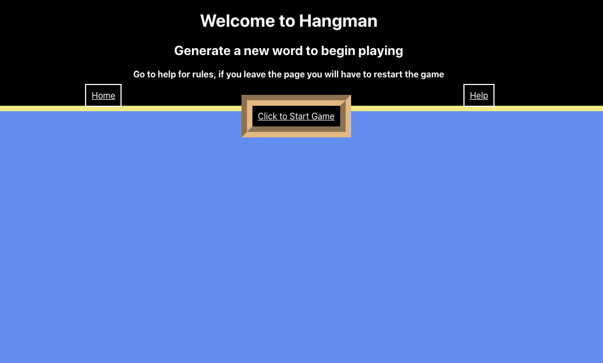
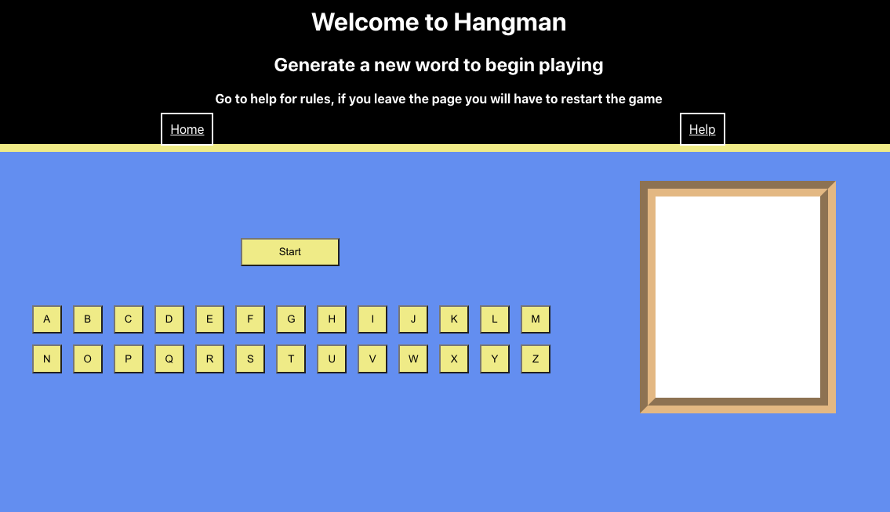
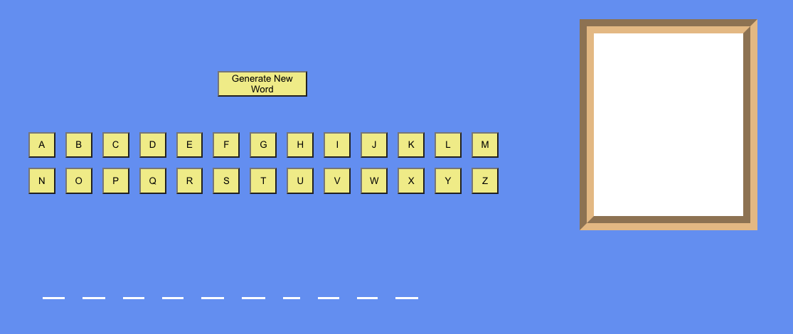
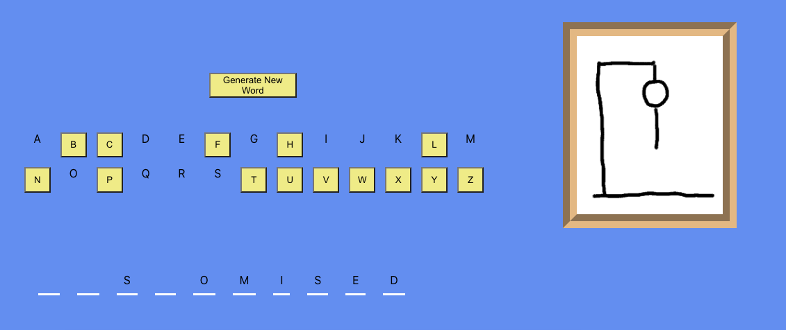
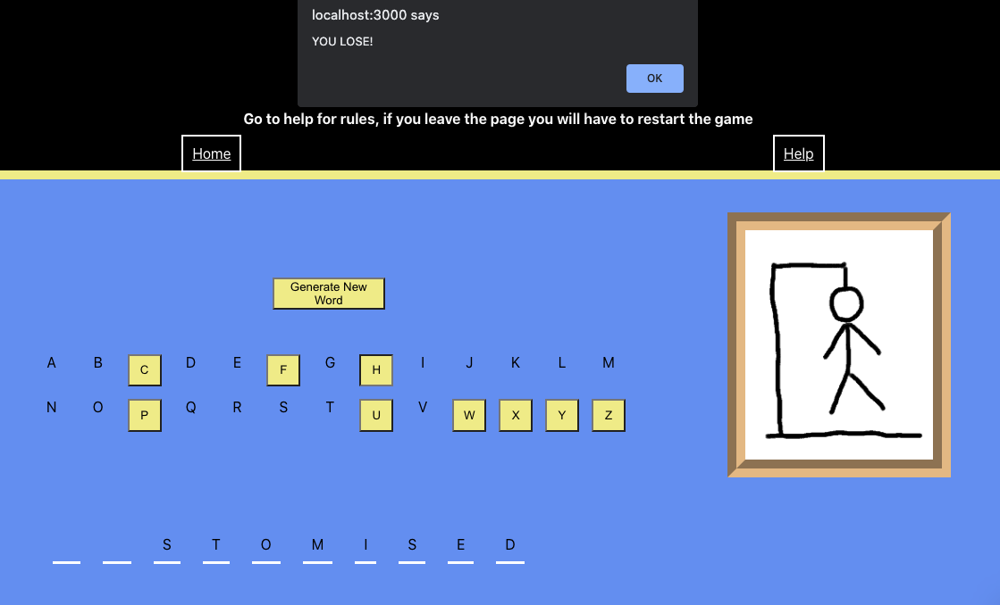
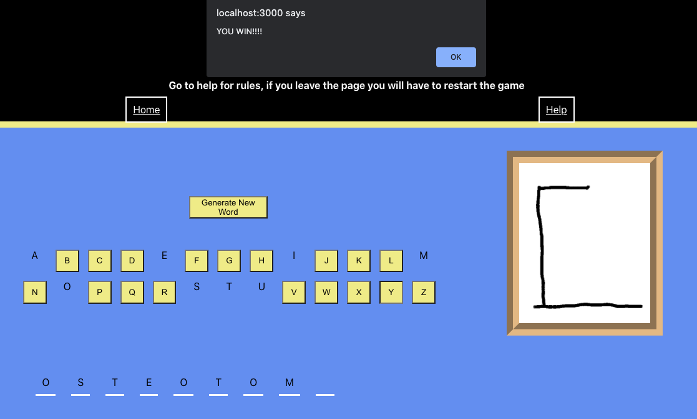

# Capstone Project - Create a React App
My final project during my Web Development Bootcamp was to create an App using React. I created a hangman game that showcases all the different skills and techniques I learned. There was certain criteria I had to follow; It had to contain different components that respond to user interaction, where a number of them were rendered using the array.Map() method. User interaction had to modify the state of some components - I utilised this by the hangman image changing state depending on whether the user selected a correct/incorrect letter. The user had to be able to request help where I explained the rules on a new "page using the react-router-dom. The app also had the be attractive, easy to use and intuitive.

1. [Installation](#install)
2. [Usage](#usage)
3. [Credits](#credits)

## Installation
* Create a folder on your local drive
* Use cd to get to the correct directory of your new folder
* Initialise the repository in your directory $ git init
* Clone the remote repository 
* Install all the correct node modules using $ npm install
* Run the app $ npm run

## Usage
When the app loads you will be taken to the landing page. 
  

Click on 'Click to Start Game' to be taken to the game page. 
  

Now click 'Start' and 'Generate a New Word', this will create a new word for you to play the game. 
  

Start the game! If you guess a correct letter the letter(s) will appear on the word, however if an incorrect guess is made the image will start updating. 
  

Win or lose you will be alerted on the outcome 
  
  

If you need help click the 'Help' link where you will find a list of the rules. 
  

## Credits
This was an individual project by Sam Baldwin